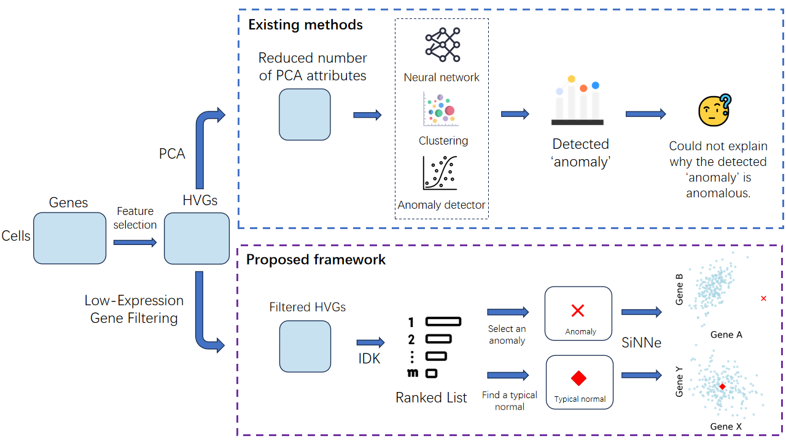

# Explainable-Rare-Cell-Identification
A PCA-free framework to not only identify rare cells in scRNA-seq data but also provide intuitive, gene-level explanations for their rarity.

[](https://opensource.org/licenses/MIT)

This repository contains the official source code for the paper:

**[A New Framework for Explainable Rare Cell Identification in
Single-Cell Transcriptomics Data]**  
*Di Su, Kai Ming Ting, Jie Zhang, Xiaorui Zhang, Xinpeng Li*  

---

## Overview

Identifying rare cell types in single-cell transcriptomics is crucial for understanding complex biological systems, but current methods often act as "black boxes." They can flag a cell as rare but cannot explain *why* in terms of specific genes. This limitation is frequently caused by dimensionality reduction techniques like PCA, which obscure the underlying biological signals.

This project introduces a novel framework for **explainable rare cell identification**. Our approach bypasses the problematic PCA step and operates directly on high-dimensional gene expression data. It is designed not only to accurately detect rare cells but also to provide intuitive, visual, and gene-level explanations for both anomalous and typical cells.

### Key Features:
- **PCA-Free Detection:** Works directly with highly variable genes to preserve biological interpretability.
- **Explainable Results:** Generates concise gene subspaces that visually explain why a specific cell is identified as rare compared to its neighbors.
- **Characterization of Normality:** Can also identify gene markers that define a "typical" cell within a cluster.
- **Core Technology:** Integrates the strengths of the Isolation Distributional Kernel (IDK) for robust anomaly scoring and SiNNe for efficient, high-dimensional explanation.

This framework serves as both a discovery tool and a validation method, enabling researchers to move from simple detection to a deeper, interpretable understanding of cellular heterogeneity.

<!--  -->

## Installation

```bash
# Clone the repository
git clone https://github.com/2002sd/Explainable-Rare-Cell-Identification.git
cd Explainable-Rare-Cell-Identification

# We recommend using a Conda environment
conda create -n rare_cell_env python=3.9
conda activate rare_cell_env

# Install dependencies
pip install -r requirements.txt```

## Usage

(Here you can add a brief example of how to run your code, e.g., how to reproduce a key figure from the paper)

...
